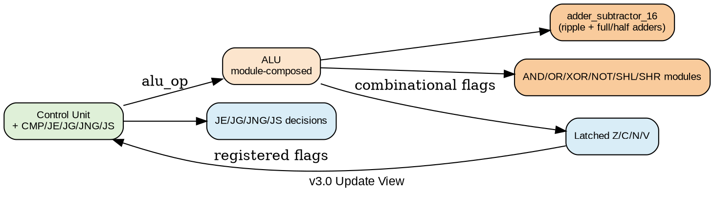

# Stack CPU — Architecture Update v3.0

## Executive Summary

Revision v3.0 extends the CPU from 26 to 31 instructions and introduces a gate-level arithmetic foundation in the ALU datapath. The update preserves the existing latched-flag control model while adding compare-oriented control flow.

Key outcomes:

- New instructions: `CMP`, `JE`, `JG`, `JNG`, `JS`
- Latched flag model preserved (`Z/C/N/V` in control unit)
- ALU now uses dedicated arithmetic/bitwise/shift submodules
- Integration testbench expanded to 15 programs

---

## Before vs After (v2.0 -> v3.0)

| Feature | v2.0 | v3.0 |
| --- | --- | --- |
| ISA size | 26 instructions | 31 instructions |
| Compare instruction | Not available | `CMP` added |
| Equality jump | Not available | `JE` added |
| Signed greater jumps | Not available | `JG`, `JNG` added |
| Sign jump alias | `JN` only | `JN` + `JS` |
| ALU internals | Monolithic combinational logic | Module-based arithmetic/bitwise/shift paths |
| Arithmetic foundation | Implicit adder inference | Explicit half/full-adder based ripple adder path |
| CPU integration tests | 10 programs | 15 programs |

---

## New ISA Additions

| Instruction | Opcode | Encoding | Branch / Action |
| --- | --- | --- | --- |
| `CMP` | `7'h18` | `16'h3000` | Compute `NOS - TOS` flags, no stack change |
| `JE addr` | `7'h29` | `16'h5200 + addr` | Jump if `Z == 1` |
| `JG addr` | `7'h2A` | `16'h5400 + addr` | Jump if signed greater (`!Z && N==V`) |
| `JNG addr` | `7'h2B` | `16'h5600 + addr` | Jump if signed not greater (`Z=1` or `N!=V`) |
| `JS addr` | `7'h2C` | `16'h5800 + addr` | Jump if sign (`N == 1`) |

---

## Datapath Changes

### ALU Module Composition

`alu.v` now selects outputs from dedicated modules:

- `adder_subtractor_16.v`
  - `ripple_adder_16.v`
    - `full_adder.v`
      - `half_adder.v`
- `bitwise_and_16.v`
- `bitwise_or_16.v`
- `bitwise_xor_16.v`
- `bitwise_not_16.v`
- `shl1_16.v`
- `shr1_16.v`

Comparator helper library:

- `comparator_16.v`

### Behavior Preserved

- `SUB` remains `NOS - TOS`.
- `SHL` carry is old MSB.
- `SHR` carry is old LSB.
- Branches still consume latched control-unit flags.

---

## Control-Unit Updates

`control_unit.v` now includes opcode decode and execute handling for:

- `OP_CMP`
- `OP_JE`
- `OP_JG`
- `OP_JNG`
- `OP_JS`

### CMP execution rule

- Requires `stack_has_two == 1`, else `S_FAULT`
- Updates `z_flag/c_flag/n_flag/v_flag` from ALU
- Does not push/pop/write back stack data

### Branch rule examples

- `JE`: `if (z_flag) pc_load = 1'b1;`
- `JG`: `if (!z_flag && (n_flag == v_flag)) pc_load = 1'b1;`
- `JNG`: `if (z_flag || (n_flag != v_flag)) pc_load = 1'b1;`
- `JS`: `if (n_flag) pc_load = 1'b1;`

---

## Verification Expansion

### ALU testbench (`alu_tb.v`)

Added CMP vectors to verify compare flags alongside existing operations.

### CPU integration testbench (`cpu_tb.v`)

Expanded to 15 programs, adding:

- CMP+JE demo
- CMP+JG demo
- CMP+JNG demo
- CMP+JS demo
- CMP underflow fault test

---

## Default Program Note

Current `instr_rom.v` active contents implement a recurring subroutine countdown loop (10 to 0 repeatedly), not a single-run halt demo.

---

## Updated Architecture Diagram (Graphviz)

---

## Files Added in v3.0

- `half_adder.v`
- `full_adder.v`
- `ripple_adder_16.v`
- `adder_subtractor_16.v`
- `bitwise_and_16.v`
- `bitwise_or_16.v`
- `bitwise_xor_16.v`
- `bitwise_not_16.v`
- `shl1_16.v`
- `shr1_16.v`
- `comparator_16.v`

---

## Conclusion

v3.0 keeps existing execution stability (latched flags and stack-safe FSM) while adding compare-based control flow and a clearer hardware-structured ALU datapath.
