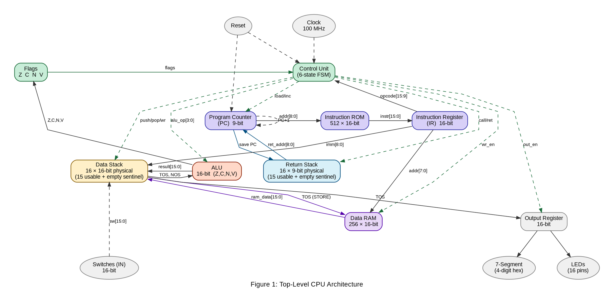
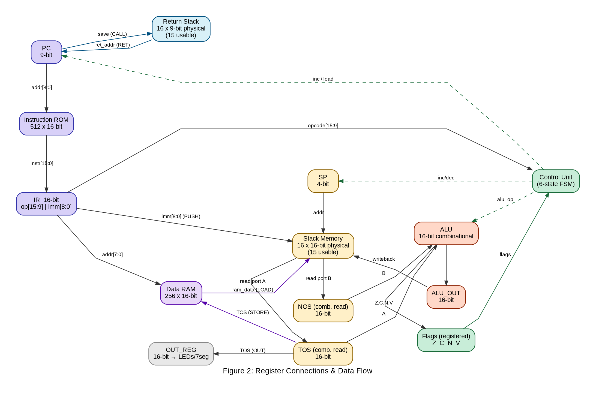
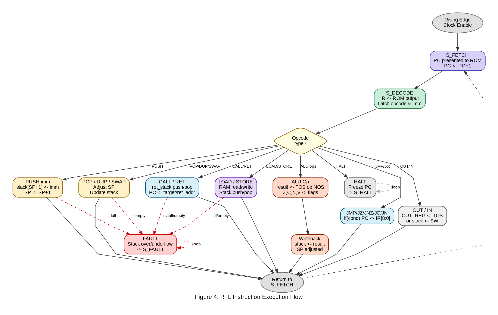
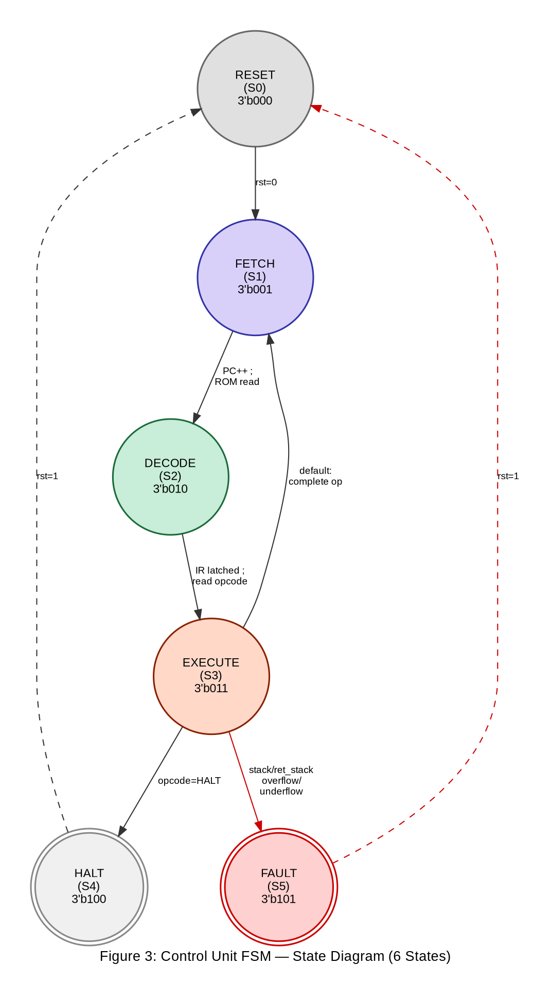
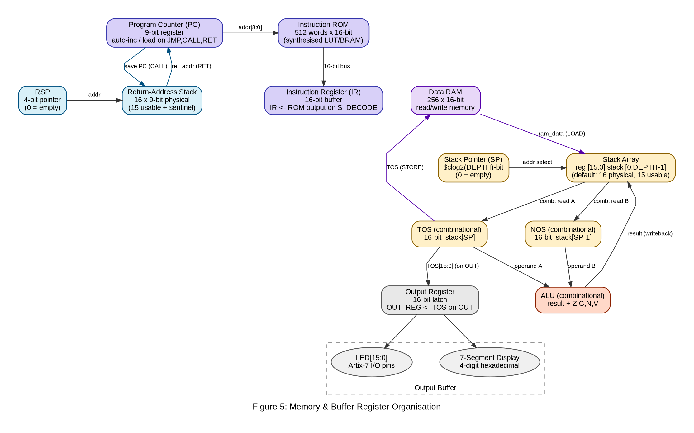

# Design & Implementation of a 16-bit Stack-based CPU

## 1. Introduction

This report presents the complete design and implementation of a custom 16-bit soft-core processor built from scratch using Verilog HDL and deployed on an Artix-7 FPGA. The design adopts a Stack Machine (zero-operand) architecture --- the same model used by the Java Virtual Machine and the Forth language --- which provides an ideal balance between architectural simplicity and demonstrable complexity.

The CPU demonstrates all core digital system design concepts such as register transfer logic, finite state machine control, ALU design, instruction set architecture, and on-chip memory organisation. The implementation is self-contained and observable in hardware via LED outputs and a 4-digit 7-segment hexadecimal display on the Basys-3 (Artix-7) development board.

### 1.1 Why a Stack Machine?

- Zero-operand ISA --- instructions never carry operand addresses; all operands are implicit on the stack.

- Compact instruction encoding --- a 7-bit opcode field is sufficient for the full ISA.

- Natural hardware mapping --- the stack maps directly to a simple register array, with no register-file decoder needed.

- Historical significance --- foundation of the JVM bytecode engine and Forth interpreters.

## 2. Component Inventory

The CPU core is composed of eleven distinct hardware components instantiated directly in the top-level wrapper. The full project contains thirteen RTL modules when helper display modules are included.

| **Component**             | **Width** | **Verilog Type** | **Function**                                                                                                                                  |
| ------------------------- | --------- | ---------------- | --------------------------------------------------------------------------------------------------------------------------------------------- |
| Program Counter (PC)      | 9-bit     | reg + adder      | Holds address of the current instruction; auto-increments each fetch; loaded by JMP/JZ/JNZ/CALL/RET.                                          |
| Instruction ROM           | 16-bit    | LUT ROM          | 512-word read-only memory storing the machine program; addressed by the 9-bit PC.                                                             |
| Instruction Register (IR) | 16-bit    | D flip-flops     | Buffers the instruction fetched from ROM; IR\[15:9\] = opcode, IR\[8:0\] = immediate operand.                                                 |
| Control Unit (FSM)        | ---       | case FSM         | 6-state finite state machine; decodes opcode and generates all control signals each cycle.                                                    |
| Stack Pointer (SP)        | 4-bit     | reg + adder      | Tracks the top-of-stack address in the parameterised stack array; increments on PUSH, decrements on POP.                                      |
| Stack Memory              | 16-bit    | reg array        | Parameterised LIFO register array (default 16 × 16-bit physical, 15 usable with empty-sentinel convention); the primary data storage element. |
| ALU                       | 16-bit    | combinational    | Accepts TOS (A) and NOS (B); outputs result and four flags (Z, C, N, V); purely combinational logic.                                          |
| Output Register           | 16-bit    | D flip-flops     | Latches TOS on OUT instruction; drives 16 LED pins and 7-segment display.                                                                     |
| Return Stack              | 9-bit     | reg array        | 16 × 9-bit physical LIFO (15 usable with empty-sentinel convention) for CALL/RET subroutine support; stores return addresses.                 |
| Data RAM                  | 16-bit    | reg array        | 256 × 16-bit read/write memory for LOAD/STORE instructions.                                                                                   |
| Clock Divider             | ---       | counter          | Divides 100 MHz system clock via a clock-enable pulse generator (~2 Hz effective rate).                                                       |

Table 1: Complete CPU Component Inventory


Figure 1: Top-Level CPU Architecture



## 3. Register File & Data Connections

Although the ISA exposes no programmer-visible general-purpose registers, the hardware maintains internal registers.

| **Register** | **Width** | **Type**     | **Function & Connections**                                                                                               |
| ------------ | --------- | ------------ | ------------------------------------------------------------------------------------------------------------------------ |
| PC           | 9-bit     | D-FF + adder | Receives: reset (→ 0), CU load signal (← JMP/CALL target or RET address), auto-increment (+1). Drives: ROM address port. |
| IR           | 16-bit    | D-FF         | Receives: ROM data bus on S_DECODE. Drives: CU opcode input (IR\[15:9\]), immediate (IR\[8:0\]).                         |
| SP           | 4-bit     | D-FF + adder | Receives: CU inc/dec/reset control. Drives: Stack array address port. Overflow/underflow flags active.                   |
| TOS          | 16-bit    | wire (comb.) | Combinational read of stack\[SP\]. Drives: ALU port A, OUT_REG input, Data RAM write data.                               |
| NOS          | 16-bit    | wire (comb.) | Combinational read of stack\[SP-1\]. Drives: ALU port B.                                                                 |
| ALU_OUT      | 16-bit    | wire         | Combinational output of ALU. Written back to stack during S_EXECUTE.                                                     |
| Z Flag       | 1-bit     | D-FF         | Updated after every TOS-modifying instruction. Drives: JZ, JNZ.                                                          |
| C Flag       | 1-bit     | D-FF         | Updated after ALU operations. Carry/borrow from ADD/SUB; bit shifted out from SHL/SHR. Drives: JC.                       |
| N Flag       | 1-bit     | D-FF         | Updated after ALU operations. MSB (sign bit) of result. Drives: JN.                                                      |
| V Flag       | 1-bit     | D-FF         | Updated after ALU operations. Signed arithmetic overflow detection.                                                      |
| OUT_REG      | 16-bit    | D-FF         | Latched from TOS on OUT. Drives: LED\[15:0\] and 7-segment display.                                                      |
| RSP          | 4-bit     | D-FF + adder | Return stack pointer for CALL/RET. Internal to return_stack.v.                                                           |
| State        | 3-bit     | D-FF         | Holds current FSM state (6 states). Internal to control_unit.v.                                                          |

Table 2: Internal Register File


Figure 2: Register Connections & Data Flow



### 3.1 Key Bus Widths

- Address bus (PC → ROM): 9-bit, 512 addressable locations.
- Instruction bus (ROM → IR): 16-bit, carries full instruction word.
- Data bus (stack ↔ ALU): 16-bit bidirectional.
- Immediate bus (IR\[8:0\] → stack): 9-bit, zero-extended to 16-bit before write.
- Data RAM address bus: 8-bit (IR\[7:0\]), 256 addressable locations.
- Return stack bus: 9-bit addresses.
- Control signals (CU → all modules): 1-bit enable lines.

## 4. Instruction Set Architecture (ISA)

### 4.1 Instruction Format

Every instruction is exactly 16 bits wide:

```md
15 9 8 0
┌────────┬───────────────┐
│OPCODE │ IMMEDIATE │
│ 7 bits │ 9 bits │
└────────┴───────────────┘
```

The 7-bit opcode field gives 128 possible instruction encodings; the design uses 26, leaving room for extension. The 9-bit immediate field covers unsigned values 0--511 and 9-bit absolute addresses for jumps and calls.

### 4.2 Complete ISA Table

| **Mnemonic**                                                          | **Opcode** | **RTL Micro-operation**                       | **Description**                    |
| --------------------------------------------------------------------- | ---------- | --------------------------------------------- | ---------------------------------- |
| **Stack Operations**                                                  |
| PUSH imm                                                              | 7\'h01     | SP←SP+1; stack\[SP\]←{7\'b0,IR\[8:0\]}        | Push 9-bit zero-extended immediate |
| POP                                                                   | 7\'h02     | SP←SP-1                                       | Discard top of stack               |
| DUP                                                                   | 7\'h03     | SP←SP+1; stack\[SP\]←TOS                      | Duplicate TOS                      |
| SWAP                                                                  | 7\'h04     | tmp←TOS; TOS←NOS; NOS←tmp                     | Swap TOS and NOS                   |
| **Arithmetic / Logic (binary --- consumes TOS & NOS, pushes result)** |
| ADD                                                                   | 7\'h10     | stack\[SP-1\]←NOS+TOS; SP←SP-1; update ZCNV   | 16-bit addition                    |
| SUB                                                                   | 7\'h11     | stack\[SP-1\]←NOS-TOS; SP←SP-1; update ZCNV   | Subtraction (NOS minus TOS)        |
| AND                                                                   | 7\'h12     | stack\[SP-1\]←NOS&TOS; SP←SP-1; update ZCNV   | Bitwise AND                        |
| OR                                                                    | 7\'h13     | stack\[SP-1\]←NOS\|TOS; SP←SP-1; update ZCNV  | Bitwise OR                         |
| XOR                                                                   | 7\'h14     | stack\[SP-1\]←NOS\^TOS; SP←SP-1; update ZCNV  | Bitwise XOR                        |
| **Arithmetic / Logic (unary --- transform TOS in place)**             |
| NOT                                                                   | 7\'h15     | stack\[SP\]←\~TOS; update ZCNV                | Bitwise complement                 |
| SHL                                                                   | 7\'h16     | stack\[SP\]←TOS\<\<1; C←TOS\[15\]; update ZNV | Left shift by 1                    |
| SHR                                                                   | 7\'h17     | stack\[SP\]←TOS\>\>1; C←TOS\[0\]; update ZNV  | Logical right shift by 1           |
| **Control Flow**                                                      |
| JMP addr                                                              | 7\'h20     | PC←IR\[8:0\]                                  | Unconditional jump                 |
| JZ addr                                                               | 7\'h21     | if(Z==1) PC←IR\[8:0\]                         | Jump if Zero flag set              |
| JNZ addr                                                              | 7\'h22     | if(Z==0) PC←IR\[8:0\]                         | Jump if Zero flag clear            |
| CALL addr                                                             | 7\'h23     | RSP++; ret\[RSP\]←PC; PC←IR\[8:0\]            | Call subroutine                    |
| RET                                                                   | 7\'h24     | PC←ret\[RSP\]; RSP--                          | Return from subroutine             |
| JC addr                                                               | 7\'h27     | if(C==1) PC←IR\[8:0\]                         | Jump if Carry flag set             |
| JN addr                                                               | 7\'h28     | if(N==1) PC←IR\[8:0\]                         | Jump if Negative flag set          |
| HALT                                                                  | 7\'h3F     | PC holds; FSM→S_HALT                          | Halt execution                     |
| **Memory**                                                            |
| LOAD addr                                                             | 7\'h25     | SP←SP+1; stack\[SP\]←RAM\[IR\[7:0\]\]         | Push data from RAM onto stack      |
| STORE addr                                                            | 7\'h26     | RAM\[IR\[7:0\]\]←TOS; SP←SP-1                 | Pop TOS into RAM                   |
| **I/O**                                                               |
| OUT                                                                   | 7\'h30     | OUT_REG←TOS; LED/7seg←OUT_REG                 | Drive LEDs and 7-seg with TOS      |
| IN                                                                    | 7\'h31     | SP←SP+1; stack\[SP\]←SW\[15:0\]               | Push switch state onto stack       |

Table 3: Complete Instruction Set Architecture (26 instructions)

### 4.3 Addressing Modes

- Immediate --- PUSH encodes a 9-bit literal in IR\[8:0\], zero-extended to 16-bit on write.
- Implicit (stack) --- all ALU operations implicitly address TOS and NOS.
- Absolute jump --- JMP/JZ/JNZ/JC/JN/CALL use IR\[8:0\] as a 9-bit absolute ROM address (512 locations).
- Return --- RET uses the return stack to restore a previously saved PC value.
- Direct memory --- LOAD/STORE use IR\[7:0\] as an 8-bit address into a 256-word data RAM.

### 4.4 Condition Code Flags

The ALU produces four condition flags, all updated after every ALU operation (ADD, SUB, AND, OR, XOR, NOT, SHL, SHR):

| **Flag**  | **Definition**                                                   | **Used by** |
| --------- | ---------------------------------------------------------------- | ----------- |
| Z (Zero)  | `result == 0`                                                    | JZ, JNZ     |
| C (Carry) | Unsigned carry/borrow from ADD/SUB; bit shifted out from SHL/SHR | JC          |
| N (Neg.)  | `result[15]` — sign bit of result                                | JN          |
| V (Ovf.)  | Signed arithmetic overflow                                       | (reserved)  |

The Z flag is also updated by non-ALU stack operations (PUSH, POP, DUP, SWAP, IN, LOAD, STORE) to reflect the new TOS value.

## 5. RTL Logic & Block Diagrams

### 5.1 Instruction Execution Flow

Every instruction follows a strict 3-state execute pipeline (FETCH → DECODE → EXECUTE). The block diagram below shows the decision tree that the Control Unit traverses each clock cycle.


Figure 4: RTL Instruction Execution Flow (Block Diagram)



### 5.2 RTL Micro-operations per State

#### S_FETCH (State 1)

```md
    PC   <= PC + 1;
    ROM captures rom[PC];
```

#### S_DECODE (State 2)

```md
    IR   <= ROM_output;
```

#### S_EXECUTE (State 3)

```md
    case (opcode)
        PUSH:  if (!full) { stack[SP+1] <= {7'b0, imm}; SP++; }
               else state <= S_FAULT;
        POP:   if (!empty) { SP--; } else state <= S_FAULT;
        DUP:   if (!full) { stack[SP+1] <= TOS; SP++; } else S_FAULT;
        SWAP:  if (has_two) { stack[SP] <= NOS; stack[SP-1] <= TOS; } else S_FAULT;
        ADD:   if (has_two) { stack[SP-1] <= NOS+TOS; SP--; ZCNV <= flags; } else S_FAULT;
        SUB:   stack[SP-1] <= NOS-TOS; SP--; ZCNV <= flags;
        NOT:   stack[SP] <= ~TOS; ZCNV <= flags;
        SHL:   stack[SP] <= TOS<<1; ZCNV <= flags;
        JMP:   PC <= IR[8:0];
        JZ:    if (Z) PC <= IR[8:0];
        JC:    if (C) PC <= IR[8:0];
        JN:    if (N) PC <= IR[8:0];
        CALL:  if (!rs_full) { RSP++; ret[RSP] <= PC; PC <= IR[8:0]; } else S_FAULT;
        RET:   if (!rs_empty) { PC <= ret[RSP]; RSP--; } else S_FAULT;
        LOAD:  if (!full) { stack[SP+1] <= RAM[IR[7:0]]; SP++; } else S_FAULT;
        STORE: if (!empty) { RAM[IR[7:0]] <= TOS; SP--; } else S_FAULT;
        OUT:   OUT_REG <= TOS;
        IN:    if (!full) { stack[SP+1] <= SW[15:0]; SP++; } else S_FAULT;
        HALT:  state <= S_HALT;
    endcase
```

## 6. Control Unit --- Finite State Machine

The Control Unit is a hardwired FSM implemented as a **6-state Moore machine**. The six states are: RESET, FETCH, DECODE, EXECUTE, HALT, and FAULT.


Figure 3: Control Unit FSM State Diagram



### 6.1 State Table

| **State** | **Encoding** | **Actions (outputs)**                                      | **Next State**                         |
| --------- | ------------ | ---------------------------------------------------------- | -------------------------------------- |
| S_RESET   | 3\'b000      | All registers cleared (PC←0, SP←0, flags←0, OUT_REG←0)     | → S_FETCH (unconditional)              |
| S_FETCH   | 3\'b001      | pc_inc=1; ROM captures rom\[PC\] synchronously             | → S_DECODE (always)                    |
| S_DECODE  | 3\'b010      | ir_load=1; IR latches ROM output from previous cycle       | → S_EXECUTE (always)                   |
| S_EXECUTE | 3\'b011      | Assert appropriate enable signals per opcode; update flags | → S_FETCH (normal) or S_HALT / S_FAULT |
| S_HALT    | 3\'b100      | halted=1; all other signals de-asserted; PC frozen         | → S_HALT (loop) or S_RESET on rst=1    |
| S_FAULT   | 3\'b101      | fault=1; all other signals de-asserted; LED shows 0xF17E   | → S_FAULT (loop) or S_RESET on rst=1   |

Table 4: FSM State Table (6 States, 3-bit Encoding)

### 6.2 Stack Safety Mechanism

The Control Unit implements **pre-emptive stack protection**. Before asserting any stack-modifying enable signal, the FSM checks the relevant status flags:

| **Instruction Type**      | **Guard Condition**  | **Action on Violation** |
| ------------------------- | -------------------- | ----------------------- |
| PUSH, DUP, IN, LOAD       | `stack_full == 1`    | Transition to S_FAULT   |
| POP, NOT, SHL, SHR, STORE | `stack_empty == 1`   | Transition to S_FAULT   |
| ADD, SUB, AND, OR, XOR    | `stack_has_two == 0` | Transition to S_FAULT   |
| SWAP                      | `stack_has_two == 0` | Transition to S_FAULT   |
| CALL                      | `rs_full == 1`       | Transition to S_FAULT   |
| RET                       | `rs_empty == 1`      | Transition to S_FAULT   |

### 6.3 Flag Management

| **Instruction**           | **Z Flag Update**          | **C, N, V Update**   |
| ------------------------- | -------------------------- | -------------------- |
| PUSH imm                  | `Z <= (immediate == 0)`    | Unchanged            |
| POP                       | `Z <= (NOS == 0)`          | Unchanged            |
| DUP                       | `Z <= (TOS == 0)`          | Unchanged            |
| SWAP                      | `Z <= (NOS == 0)`          | Unchanged            |
| ADD, SUB, AND, OR, XOR    | `Z <= ALU_zero_flag`       | `C,N,V <= ALU flags` |
| NOT, SHL, SHR             | `Z <= ALU_zero_flag`       | `C,N,V <= ALU flags` |
| LOAD                      | `Z <= (ram_data == 0)`     | Unchanged            |
| STORE                     | `Z <= (NOS == 0)`          | Unchanged            |
| IN                        | `Z <= (switch_value == 0)` | Unchanged            |
| JMP, JZ, JNZ, JC, JN, OUT | Unchanged                  | Unchanged            |
| CALL, RET                 | Unchanged                  | Unchanged            |

## 7. Memory & Buffer Register Organisation

The CPU uses a strict Harvard architecture --- instruction memory and data memory are physically separate.


Figure 5: Memory & Buffer Register Organisation



### 7.1 Instruction Memory (ROM)

- Size: 512 words × 16 bits = 1024 bytes.
- Address: 9-bit, driven by the Program Counter.
- Latency: Single-cycle synchronous read, gated by clock enable.
- Default fill: All unused locations initialised to `HALT` (16'h7E00).

### 7.2 Data Stack (Primary Data Storage)

- Implementation: `reg [15:0] stack_mem [0:DEPTH-1]` --- parameterised register array (default 16 physical entries; 15 usable with `SP=0` empty sentinel).
- Access: Indexed by SP. Reads are combinational; writes are synchronous.
- Stack pointer width is auto-calculated: `SP_WIDTH = $clog2(DEPTH)`.
- Overflow: `stack_full` when `SP == DEPTH-1`. Underflow: `stack_empty` when `SP == 0`.

### 7.3 Data RAM

- Size: 256 × 16-bit read/write memory.
- Address: 8-bit, from IR\[7:0\] (immediate field lower byte).
- Read: Combinational — always available at `data_out = ram[addr]`.
- Write: Synchronous, gated by `clk_en && wr_en` (STORE instruction).
- Provides general-purpose storage for arrays, lookup tables, and intermediate results.

### 7.4 Return-Address Stack

- Size: 16 physical entries × 9-bit addresses (15 usable with `RSP=0` empty sentinel).
- Purpose: Stores return addresses for CALL/RET subroutine support.
- Architecturally independent of the data stack (Forth dual-stack convention).
- Push on CALL (saves current PC), pop on RET (restores PC).
- Overflow/underflow protected: faults to S_FAULT if exhausted.

### 7.5 Output Buffer Register

- 16-bit D-FF latch; written only on OUT instruction.
- Drives LED\[15:0\] and 4-digit 7-segment hex display.
- On fault, displays `0xF17E` as visual error indicator.

## 8. Verilog Module Hierarchy

```md
    cpu_top.v               // Top-level; board pin mapping
    ├── clk_div.v           // 100 MHz → clock-enable pulse at ~2 Hz
    ├── pc.v                // 9-bit PC: reset / increment / load
    ├── instr_rom.v         // 512×16 ROM, initialised with program
    ├── instr_reg.v         // 16-bit IR with synchronous load
    ├── control_unit.v      // 6-state FSM (26 opcodes, 4 flags)
    ├── alu.v               // Combinational: result + Z,C,N,V flags
    ├── stack.v             // Parameterised data stack (default 16×16 physical, 15 usable)
    ├── return_stack.v      // Return-address stack (16×9 physical, 15 usable)
    ├── data_ram.v          // 256×16 read/write data memory (LOAD/STORE)
    ├── output_reg.v        // 16-bit latch → LED[15:0]
    └── seg_display_controller.v  // 4-digit hex 7-segment multiplexer
        └── hex_to_7seg.v         // Hex nibble → 7-segment decoder
```

### 8.1 Top-Level Port Map

```verilog
    module cpu_top (
        input  wire        clk,         // 100 MHz board oscillator
        input  wire        rst,         // Active-high reset (btnC / U18)
        input  wire [15:0] sw,          // Slide switches (IN)
        output wire [15:0] led,         // LED bar output
        output wire [6:0]  seg,         // 7-segment cathode signals
        output wire [3:0]  an           // 7-segment anode signals
    );
```

### 8.2 Clock Domain Strategy

All sequential modules operate on the single 100 MHz master clock and gate their register updates with a clock-enable signal. This single-clock-domain approach avoids derived clock problems. The 7-segment display controller runs at the full 100 MHz rate for flicker-free multiplexing.

## 9. Example Programs

### 9.1 Program 1: Basic Arithmetic (PUSH + ADD + OUT)

```verilog
    0x00  0x0205   PUSH 5       // stack: [5]
    0x01  0x0203   PUSH 3       // stack: [5, 3]
    0x02  0x2000   ADD          // stack: [8]
    0x03  0x6000   OUT          // LED = 0x0008
    0x04  0x7E00   HALT
```

### 9.2 Program 2: Countdown Loop (JNZ)

```verilog
    0x00  0x020A    PUSH 10       [10]
    0x01  0x0600    DUP           [count, count]
    0x02  0x6000    OUT           LED = count
    0x03  0x0400    POP           [count]
    0x04  0x0201    PUSH 1        [count, 1]
    0x05  0x2200    SUB           [count-1]
    0x06  0x4401    JNZ 0x01      loop if != 0
    0x07  0x6000    OUT           LED = 0
    0x08  0x7E00    HALT
```

### 9.3 Program 3: Bit Shift Demonstration

```verilog
    0x00  0x0201    PUSH 1        [1]
    0x01-0x04       SHL ×4        [16]
    0x05  0x6000    OUT           LED = 0x0010
    0x06  0x7E00    HALT
```

### 9.4 Program 4: CALL/RET — Subroutine Call

```verilog
    // Main: call "double" subroutine to compute 5 × 2 = 10
    0x00  0x0205    PUSH 5        [5]
    0x01  0x4604    CALL 0x04     save PC=0x02 to ret stack, jump to 0x04
    0x02  0x6000    OUT           LED = 0x000A (10)
    0x03  0x7E00    HALT
    // Subroutine "double" at address 0x04:
    0x04  0x0600    DUP           [5, 5]
    0x05  0x2000    ADD           [10]
    0x06  0x4800    RET           return to 0x02
```

### 9.5 Program 5: LOAD/STORE — Data RAM Access

```verilog
    // Store 42 and 58 in RAM, load them back, add → 100 (0x0064)
    0x00  0x022A    PUSH 42       [42]
    0x01  0x4C00    STORE 0       RAM[0]=42, stack pops
    0x02  0x023A    PUSH 58       [58]
    0x03  0x4C01    STORE 1       RAM[1]=58, stack pops
    0x04  0x4A00    LOAD 0        [42]
    0x05  0x4A01    LOAD 1        [42, 58]
    0x06  0x2000    ADD           [100]
    0x07  0x6000    OUT           LED = 0x0064
    0x08  0x7E00    HALT
```

## 10. Conclusion

This report has presented a complete architectural specification and implementation for a 16-bit stack-based CPU targeting an Artix-7 FPGA. The design features a 26-instruction ISA with subroutine support (CALL/RET), general-purpose data memory (LOAD/STORE), and a 4-flag condition code register (Z, C, N, V) enabling signed and unsigned comparisons. The 6-state FSM control unit includes pre-emptive stack safety protection with fault detection. The parameterised data stack, 512-word instruction ROM, 256-word data RAM, and dedicated return-address stack provide a complete computing platform capable of executing non-trivial programs. The single-clock-domain, clock-enable architecture ensures reliable synthesis and clean timing on the target FPGA.
