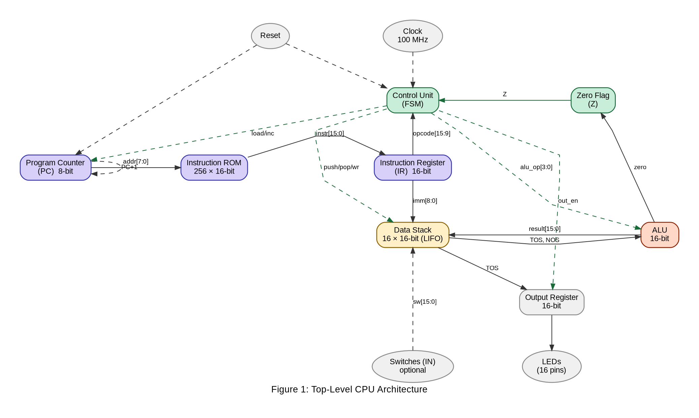
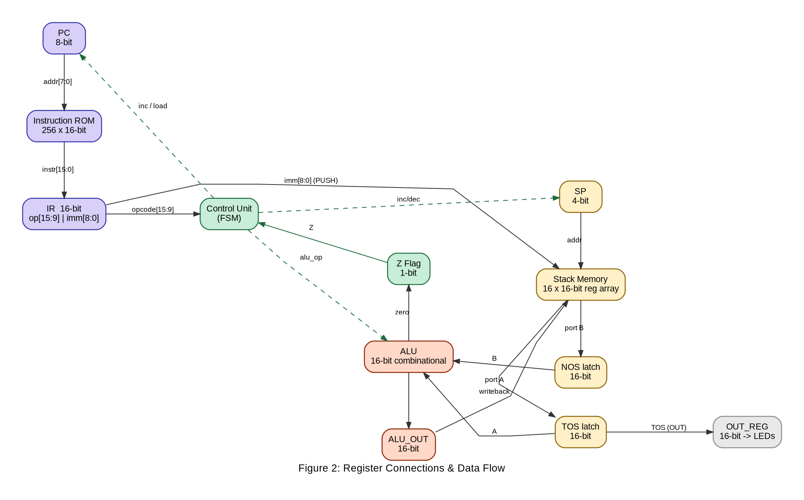
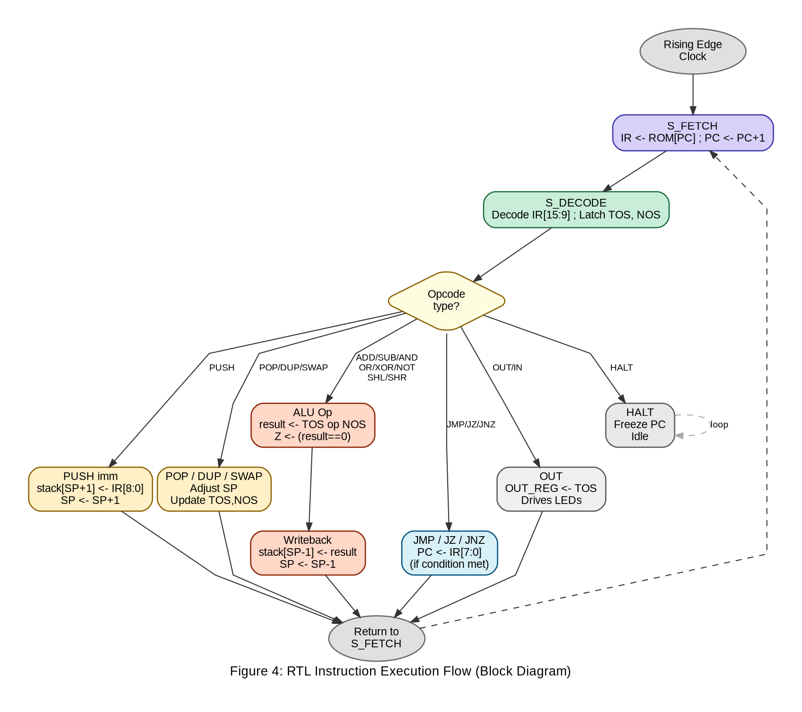
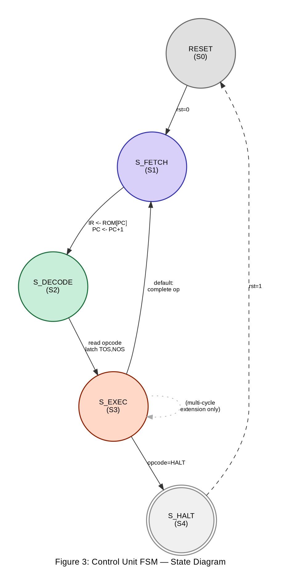
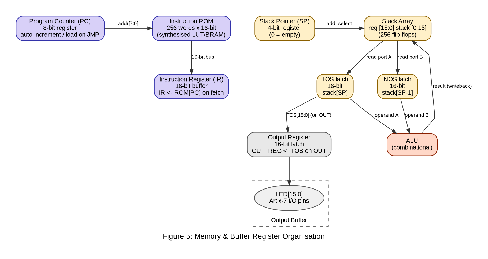

# Design & Implementation of a 16-bit Stack-based CPU

## 1. Introduction

This report presents the complete design and implementation plan for a custom 16-bit soft-core processor built from scratch using Verilog HDL and deployed on an Artix-7 FPGA. The design adopts a Stack Machine (zero-operand) architecture --- the same model used by the Java Virtual Machine and the Forth language --- which provides an ideal balance between architectural simplicity and demonstrable complexity.

The CPU demonstrates all core digital system design concepts such as register transfer logic, finite state machine control, ALU design, instruction set architecture, and on-chip memory organisation. The implementation is self-contained and observable in hardware via LED outputs on the Basys-3 / Nexys-4 DDR (Artix-7) development board.

### 1.1 Why a Stack Machine?

- Zero-operand ISA --- instructions never carry operand addresses; all operands are implicit on the stack.

- Compact instruction encoding --- a 7-bit opcode field is sufficient for the full ISA.

- Natural hardware mapping --- the stack maps directly to a simple register array, with no register-file decoder needed.

- Historical significance --- foundation of the JVM bytecode engine and Forth interpreters.

## 2. Component Inventory

The CPU is composed of nine distinct hardware components, each implemented as a separate Verilog module and instantiated in the top-level wrapper. Table 1 lists every component, its bit-width, implementation type, and role.

| **Component**             | **Width** | **Verilog Type** | **Function**                                                                                                |
| ------------------------- | --------- | ---------------- | ----------------------------------------------------------------------------------------------------------- |
| Program Counter (PC)      | 8-bit     | reg + adder      | Holds address of the current instruction; auto-increments each fetch; loaded by JMP/JZ.                     |
| Instruction ROM           | 16-bit    | LUT ROM          | 256-word read-only memory storing the machine program; addressed by PC.                                     |
| Instruction Register (IR) | 16-bit    | D flip-flops     | Buffers the instruction fetched from ROM; IR\[15:9\] = opcode, IR\[8:0\] = immediate operand.               |
| Control Unit (FSM)        | ---       | case FSM         | 4-state finite state machine; decodes opcode and generates all control signals each cycle.                  |
| Stack Pointer (SP)        | 4-bit     | reg + adder      | Tracks the top-of-stack address in the 16-entry stack array; increments on PUSH, decrements on POP/ALU ops. |
| Stack Memory              | 16-bit    | reg array        | 16 × 16-bit register array (reg \[15:0\] stack \[0:15\]); the sole data storage element.                    |
| ALU                       | 16-bit    | combinational    | Accepts TOS (A) and NOS (B); outputs result and zero flag; purely combinational logic.                      |
| Output Register           | 16-bit    | D flip-flops     | Latches TOS on OUT instruction; drives 16 LED pins on the FPGA board.                                       |
| Clock Divider             | ---       | counter          | Divides 100 MHz system clock to a lower frequency for simulation visibility (e.g., 1 Hz demo).              |

Table 1: Complete CPU Component Inventory


Figure 1: Top-Level CPU Architecture



## 3. Register File & Data Connections

Although the ISA exposes no programmer-visible general-purpose registers, the hardware maintains nine internal registers. Table 2 defines each register and its connections to other components.

| **Register** | **Width** | **Type**     | **Function & Connections**                                                                                         |
| ------------ | --------- | ------------ | ------------------------------------------------------------------------------------------------------------------ |
| PC           | 8-bit     | D-FF + adder | Receives: reset (→ 0), CU load signal (←JMP target from IR\[7:0\]), auto-increment (+1). Drives: ROM address port. |
| IR           | 16-bit    | D-FF         | Receives: ROM data bus on every S_FETCH. Drives: CU opcode input (IR\[15:9\]), stack immediate input (IR\[8:0\]).  |
| SP           | 4-bit     | D-FF + adder | Receives: CU inc/dec/reset control. Drives: Stack array address port. Overflow/underflow flags optional.           |
| TOS latch    | 16-bit    | D-FF         | Updated every time stack is written. Drives: ALU port A, OUT_REG input. Read without latency by ALU.               |
| NOS latch    | 16-bit    | D-FF         | Updated every time SP changes. Drives: ALU port B. Always holds stack\[SP-1\].                                     |
| ALU_OUT      | 16-bit    | wire/reg     | Combinational output of ALU. Written back to stack\[SP-1\] in S_EXECUTE for all binary ALU ops.                    |
| Z Flag       | 1-bit     | D-FF         | Set to 1 when ALU result == 0. Drives: CU conditional branch logic (JZ, JNZ).                                      |
| OUT_REG      | 16-bit    | D-FF         | Latched from TOS when CU asserts out_en (OUT instruction). Drives: LED\[15:0\] board pins.                         |
| State        | 2-bit     | D-FF         | Holds current FSM state: 00=RESET, 01=FETCH, 10=DECODE, 11=EXECUTE. Internal to control_unit.v.                    |

Table 2: Internal Register File


Figure 2: Register Connections & Data Flow



### 3.1 Key Bus Widths

- Address bus (PC → ROM): 8-bit, 256 addressable locations.

- Instruction bus (ROM → IR): 16-bit, carries full instruction word.

- Data bus (stack ↔ ALU): 16-bit bidirectional.

- Immediate bus (IR\[8:0\] → stack): 9-bit, zero-extended to 16-bit before write.

- Control signals (CU → all modules): 1-bit enable lines (push_en, pop_en, alu_en, out_en, pc_load, pc_inc).

## 4. Instruction Set Architecture (ISA)

### 4.1 Instruction Format

Every instruction is exactly 16 bits wide:

```md
15      9 8             0
┌────────┬───────────────┐
│OPCODE  │ IMMEDIATE     │
│ 7 bits │ 9 bits        │
└────────┴───────────────┘
```

The 7-bit opcode field gives 128 possible instruction encodings; the design uses only 20, leaving ample room for extension. The 9-bit immediate field covers unsigned values 0--511; larger values require multi-instruction sequences.

### 4.2 Complete ISA Table

| **Mnemonic**                                                          | **Opcode** | **RTL Micro-operation**                | **Description**                    |
| --------------------------------------------------------------------- | ---------- | -------------------------------------- | ---------------------------------- |
| **Stack Operations**                                                  |
| PUSH imm                                                              | 7\'h01     | SP←SP+1; stack\[SP\]←{7\'b0,IR\[8:0\]} | Push 9-bit zero-extended immediate |
| POP                                                                   | 7\'h02     | SP←SP-1                                | Discard top of stack               |
| DUP                                                                   | 7\'h03     | SP←SP+1; stack\[SP\]←TOS               | Duplicate TOS                      |
| SWAP                                                                  | 7\'h04     | tmp←TOS; TOS←NOS; NOS←tmp              | Swap TOS and NOS                   |
| **Arithmetic / Logic (binary --- consumes TOS & NOS, pushes result)** |
| ADD                                                                   | 7\'h10     | stack\[SP-1\]←NOS+TOS; SP←SP-1         | 16-bit addition                    |
| SUB                                                                   | 7\'h11     | stack\[SP-1\]←NOS-TOS; SP←SP-1         | Subtraction (NOS minus TOS)        |
| AND                                                                   | 7\'h12     | stack\[SP-1\]←NOS&TOS; SP←SP-1         | Bitwise AND                        |
| OR                                                                    | 7\'h13     | stack\[SP-1\]←NOS\|TOS; SP←SP-1        | Bitwise OR                         |
| XOR                                                                   | 7\'h14     | stack\[SP-1\]←NOS\^TOS; SP←SP-1        | Bitwise XOR                        |
| SHL                                                                   | 7\'h16     | stack\[SP\]←TOS\<\<1; Z←(result==0)    | Left shift by 1 (unary)            |
| SHR                                                                   | 7\'h17     | stack\[SP\]←TOS\>\>1; Z←(result==0)    | Logical right shift by 1 (unary)   |
| NOT                                                                   | 7\'h15     | stack\[SP\]←\~TOS                      | Bitwise complement (unary)         |
| **Control Flow**                                                      |
| JMP addr                                                              | 7\'h20     | PC←IR\[7:0\]                           | Unconditional jump                 |
| JZ addr                                                               | 7\'h21     | if(Z==1) PC←IR\[7:0\]                  | Jump if Zero flag set              |
| JNZ addr                                                              | 7\'h22     | if(Z==0) PC←IR\[7:0\]                  | Jump if Zero flag clear            |
| HALT                                                                  | 7\'h3F     | PC holds; FSM→S_HALT                   | Halt execution                     |
| **I/O**                                                               |
| OUT                                                                   | 7\'h30     | OUT_REG←TOS; LED\[15:0\]←OUT_REG       | Drive LEDs with TOS value          |
| IN                                                                    | 7\'h31     | SP←SP+1; stack\[SP\]←SW\[15:0\]        | Push switch state (optional)       |

Table 3: Complete Instruction Set Architecture (ISA)

### 4.3 Addressing Modes

- Immediate --- PUSH encodes a 9-bit literal in IR\[8:0\], zero-extended to 16-bit on write.

- Implicit (stack) --- all ALU operations implicitly address TOS and NOS; no address field needed.

- Absolute jump --- JMP/JZ/JNZ use IR\[7:0\] as an 8-bit absolute ROM address (256 locations).

## 5. RTL Logic & Block Diagrams

### 5.1 Instruction Execution Flow

Every instruction follows a strict 3-state pipeline. The block diagram below shows the decision tree that the Control Unit traverses each clock cycle.


Figure 4: RTL Instruction Execution Flow (Block Diagram)



### 5.2 RTL Micro-operations per State

#### S_FETCH (State 1)

```md
    IR   <= ROM[PC];
    PC   <= PC + 1;
```

#### S_DECODE (State 2)

```md
    opcode <= IR[15:9];
    imm    <= IR[8:0];
    TOS    <= stack[SP];      // latch for ALU speed
     NOS    <= stack[SP-1];
```

#### S_EXECUTE (State 3) --- selected cases

```md
    case (opcode)
        PUSH: stack[SP+1] <= {7'b0, imm}; SP <= SP + 1;
        POP:  SP <= SP - 1;
        DUP:  stack[SP+1] <= TOS; SP <= SP + 1;
        ADD:  stack[SP-1] <= NOS + TOS; SP <= SP-1; Z <= (result==0);
        SUB:  stack[SP-1] <= NOS - TOS; SP <= SP-1; Z <= (result==0);
        AND:  stack[SP-1] <= NOS & TOS; SP <= SP-1; Z <= (result==0);
        SHL:  stack[SP]   <= TOS << 1;  Z <= (result==0);
        SHR:  stack[SP]   <= TOS >> 1;  Z <= (result==0);
        JMP:  PC <= IR[7:0];
        JZ:   if (Z) PC <= IR[7:0];
        JNZ:  if (!Z) PC <= IR[7:0];
        OUT:  OUT_REG <= TOS;
        HALT: state <= S_HALT;
    endcase
```

## 6. Control Unit --- Finite State Machine

The Control Unit is a hardwired FSM implemented as a 4-state Moore machine. Each state drives a fixed set of combinational control signals to the other modules.


Figure 3: Control Unit FSM State Diagram



### 6.1 State Table

| **State** | **Encoding** | **Actions (outputs)**                        | **Next State**        |
| --------- | ------------ | -------------------------------------------- | --------------------- |
| S_RESET   | 2\'b00       | PC←0; SP←0; Z←0; OUT_REG←0                   | → S_FETCH when rst=0  |
| S_FETCH   | 2\'b01       | ir_ld=1; pc_inc=1                            | → S_DECODE (always)   |
| S_DECODE  | 2\'b10       | Latch TOS & NOS from stack                   | → S_EXECUTE (always)  |
| S_EXECUTE | 2\'b11       | Assert appropriate enable signals per opcode | → S_FETCH (or S_HALT) |
| S_HALT    | 2\'b11\*     | All signals de-asserted; PC frozen           | → S_RESET when rst=1  |

Table 4: FSM State Table

## 7. Memory & Buffer Register Organisation

The CPU uses a strict Harvard architecture --- instruction memory and data memory are physically separate and use independent address spaces.


Figure 5: Memory & Buffer Register Organisation



### 7.1 Instruction Memory (ROM)

- Type: Synthesised read-only memory using Verilog parameter initialisation (\$readmemh or initial block).

- Size: 256 words × 16 bits = 512 bytes.

- Address: 8-bit, driven directly by the Program Counter.

- Latency: Single-cycle synchronous read; IR latches the output on the rising edge during S_FETCH.

### 7.2 Data Stack (Primary Data Storage)

- Implementation: reg \[15:0\] stack \[0:15\] --- a 16-entry synchronous register array (256 flip-flops on the FPGA).

- Access: Indexed by SP (4-bit). Reads are combinational (asynchronous); writes are synchronous on rising clock edge.

- TOS latch: A dedicated 16-bit D-FF holds stack\[SP\] after each write, eliminating a read-cycle penalty during S_DECODE.

- NOS latch: Similarly holds stack\[SP-1\] for binary ALU operations.

- Overflow detection: assert stack_full when SP == 4\'hF and PUSH is attempted.

- Underflow detection: assert stack_empty when SP == 4\'h0 and POP/ALU is attempted.

### 7.3 Output Buffer Register

- 16-bit D-FF latch; written only when out_en is asserted by the Control Unit (OUT instruction).

- Drives LED\[15:0\] on the FPGA board; held until the next OUT instruction.

- Optional extension: drive a 4-digit 7-segment display to show TOS in hexadecimal.

## 8. Verilog Module Hierarchy

Each hardware component maps to exactly one Verilog module. The top-level wrapper instantiates all modules and wires them together using named port connections.

```md
    cpu_top.v          // Top-level; board pin mapping (.xdc constraint file)
    ├── clk_div.v      // 100 MHz → slow clock for demo
    ├── pc.v           // 8-bit PC: reset / increment / load
    ├── instr_rom.v    // 256×16 ROM, initialised from hex file
    ├── instr_reg.v    // 16-bit IR with synchronous load
    ├── control_unit.v // FSM: RESET/FETCH/DECODE/EXECUTE/HALT
    ├── alu.v          // Combinational: result, zero_flag
    ├── stack.v        // reg [15:0] stack[0:15]; SP; TOS/NOS latches
    └── output_reg.v   // 16-bit latch → LED[15:0]
```

### 8.1 Top-Level Port Map

```verilog
    module cpu_top (
        input  wire        clk,         // 100 MHz board oscillator
        input  wire        rst,         // Active-high reset (BTN0)
        input  wire [15:0] sw,          // Slide switches (optional IN)
        output wire [15:0] led          // LED bar output
    );
```

## 9. Example Programs

### 9.1 Program 1: Basic Arithmetic (PUSH + ADD + OUT)

```verilog
    // Computes (5 + 3) and displays result on LEDs
    // Expected LED output: 0x0008
    ADDR  OPCODE   INSTR
    0x00  0x0201   PUSH 5       // stack: [5]
    0x01  0x0601   PUSH 3       // stack: [5, 3]
    0x02  0x2000   ADD          // stack: [8]
    0x03  0x6000   OUT          // LED = 0x0008
    0x04  0x7E00   HALT
```

### 9.2 Program 2: Countdown Loop (JNZ)

```verilog
    // Counts from 10 down to 0; OUT on each step
    ADDR  INSTR
    0x00  PUSH 10     // stack: [10]
    0x01  DUP         // stack: [10, 10]
    0x02  OUT         // LED = current count
    0x03  PUSH 1
    0x04  SUB         // count - 1
    0x05  DUP
    0x06  JNZ 0x01    // loop while count != 0
    0x07  HALT
```

### 9.3 Program 3: Bit Shift Demonstration (SHL / SHR)

```verilog
    // Push 0x0001, shift left 4 times → 0x0010, OUT
    0x00  PUSH 1
    0x01  SHL
    0x02  SHL
    0x03  SHL
    0x04  SHL
    0x05  OUT         // LED = 0x0010
    0x06  HALT
```

## 10. Conclusion

This report has presented a complete architectural specification for a 16-bit stack-based CPU targeting an Artix-7 FPGA. The design covers all components from the program counter and instruction ROM, through the FSM-based control unit, to the 16-entry stack and output register. The ISA of 20 instructions is sufficient to write non-trivial programs (arithmetic, loops, bit manipulation) while remaining simple enough.
