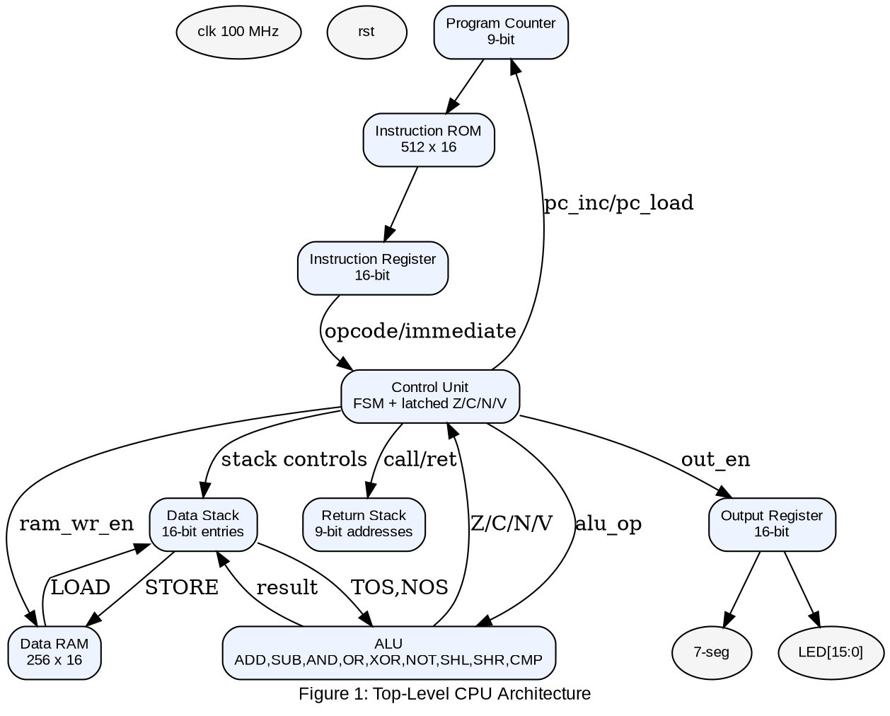
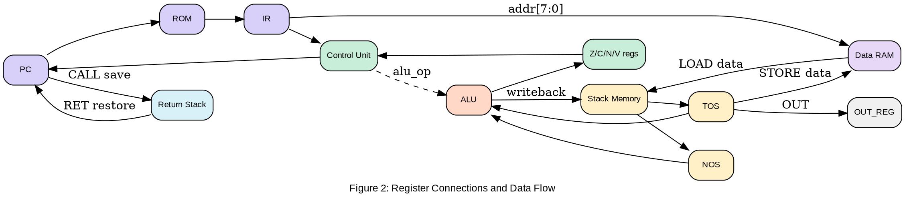
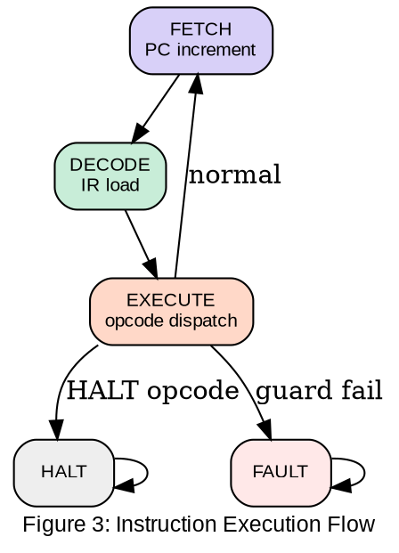
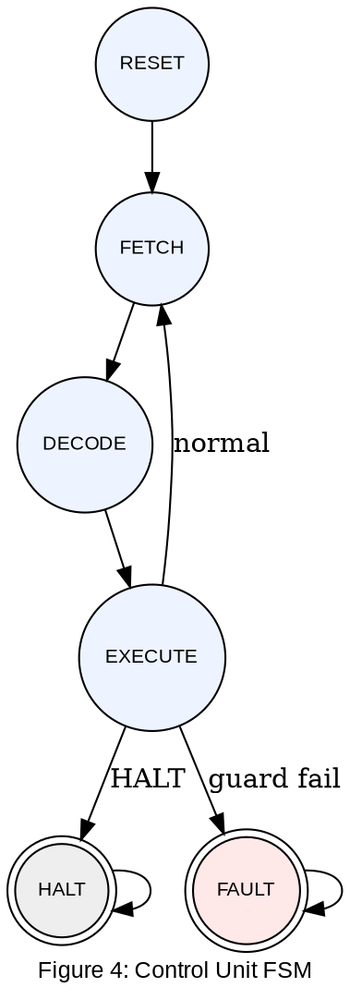
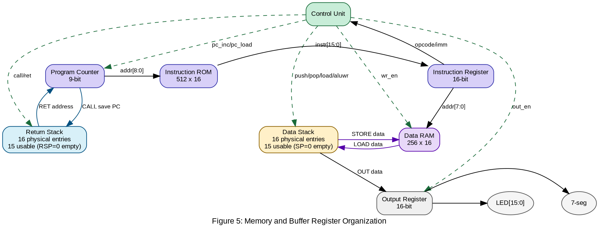

# Design and Implementation of a 16-bit Stack-Based CPU

## 1. Introduction

This report presents the complete design and implementation of a custom 16-bit soft-core processor built in Verilog HDL and targeted to an Artix-7 FPGA (Basys 3, `xc7a35ticpg236-1L`). The design follows a stack-machine (zero-operand) architecture, where operands are implicitly taken from the data stack and results are written back to the same stack.

The implementation demonstrates key digital system design topics including RTL design, hardwired FSM control, ALU datapath construction, instruction set design, on-chip memory integration, and hardware-visible output through LEDs and 7-segment display.

### 1.1 Why a Stack Machine?

- Zero-operand ISA reduces instruction complexity because operands are implicit (`TOS`, `NOS`).
- Compact encoding is achieved with a 7-bit opcode plus 9-bit immediate field.
- Hardware mapping is direct because no general-purpose register file decoder is required.
- The model is educationally strong for control/datapath co-design and stack-safety reasoning.

### 1.2 How the System Works

The system is designed to be a complete CPU implementation with the following features:

- a 16-bit stack CPU with 31 instructions,
- a 6-state hardwired control FSM,
- separate instruction/data memory,
- a dedicated return stack for subroutines,
- and FPGA-visible outputs through LEDs and 7-segment display.

How it works at runtime:

- the control unit cycles through `FETCH -> DECODE -> EXECUTE`,
- instructions are read from ROM into IR,
- stack and ALU operations execute according to opcode,
- guarded checks prevent invalid stack/return-stack operations,
- and output instructions update the display path.

## 2. Component Inventory

The top-level CPU wrapper (`cpu_top.v`) directly instantiates 11 major functional blocks. The project RTL directory (`stack_cpu.srcs/sources_1/new`) contains 24 Verilog modules in total.

| Component | Width | Verilog Type | Function |
| --- | --- | --- | --- |
| Program Counter (PC) | 9-bit | reg + increment/load | Holds current ROM address, increments in fetch, loads on branch/call/ret |
| Instruction ROM | 16-bit | ROM array | 512 x 16 instruction memory |
| Instruction Register (IR) | 16-bit | D-FF register | Latches fetched instruction; exposes `opcode[15:9]` and `immediate[8:0]` |
| Control Unit (FSM) | 3-bit state + control lines | hardwired FSM | 6-state control, opcode decode, guard checking, latched flags |
| Data Stack | 16-bit entries | register array | Main LIFO operand/result storage |
| Return Stack | 9-bit entries | register array | Dedicated call/return address storage |
| ALU | 16-bit | combinational | ADD/SUB/AND/OR/XOR/NOT/SHL/SHR/CMP plus Z/C/N/V flags |
| Data RAM | 16-bit | register array | 256 x 16 read/write memory for LOAD/STORE |
| Output Register | 16-bit | D-FF register | Latches TOS on `OUT` and drives display path |
| Clock Divider | pulse generator | counter | Generates `clk_en` pulse from 100 MHz source clock |
| 7-Segment Controller | mux + decoder | combinational/sequential | Displays output value as 4-digit hexadecimal |

Table 1: CPU Component Inventory


Figure 1: Top-Level CPU Architecture



## 3. Register File and Data Connections

The ISA has no programmer-visible general-purpose registers, but the implementation maintains internal architectural and control registers.

| Register / Signal | Width | Type | Function |
| --- | --- | --- | --- |
| `PC` | 9-bit | sequential register | Instruction address source for ROM |
| `IR` | 16-bit | sequential register | Latched instruction word |
| `SP` | 4-bit (default depth) | sequential pointer | Data stack top index (`0` means empty sentinel) |
| `TOS` | 16-bit | combinational wire | `stack_mem[SP]` view |
| `NOS` | 16-bit | combinational wire | `stack_mem[SP-1]` view |
| `RSP` | 4-bit (default depth) | sequential pointer | Return-stack top index |
| `z_flag` | 1-bit | sequential register | Latched zero flag |
| `c_flag` | 1-bit | sequential register | Latched carry/borrow/shift-out flag |
| `n_flag` | 1-bit | sequential register | Latched sign flag |
| `v_flag` | 1-bit | sequential register | Latched overflow flag |
| `OUT_REG` | 16-bit | sequential register | Output holding register for LEDs and 7-segment display |
| `state` | 3-bit | sequential register | Current control FSM state |

Table 2: Internal Register and Data Path Signals


Figure 2: Register Connections and Data Flow



### 3.1 Key Bus Widths

- PC address bus (`PC -> ROM`): 9 bits (512 locations)
- Instruction bus (`ROM -> IR`): 16 bits
- Stack/ALU datapath: 16 bits
- Immediate field (`IR[8:0]`): 9 bits, zero-extended on PUSH
- Data RAM address: 8 bits (`IR[7:0]`)
- Return-stack address width: 9 bits

## 4. Instruction Set Architecture (ISA)

### 4.1 Instruction Format

Each instruction is exactly 16 bits:

```text
[15:9] opcode (7 bits) | [8:0] immediate (9 bits)
```

The 7-bit opcode space provides 128 possible encodings. The implemented ISA uses 31 instructions.

### 4.2 Complete ISA Table (31 Instructions)

| Group | Instruction | Opcode | Description |
| --- | --- | --- | --- |
| Stack | PUSH | `7'h01` | Push immediate |
| Stack | POP | `7'h02` | Pop TOS |
| Stack | DUP | `7'h03` | Duplicate TOS |
| Stack | SWAP | `7'h04` | Swap TOS/NOS |
| ALU | ADD | `7'h10` | `NOS + TOS` |
| ALU | SUB | `7'h11` | `NOS - TOS` |
| ALU | AND | `7'h12` | Bitwise AND |
| ALU | OR | `7'h13` | Bitwise OR |
| ALU | XOR | `7'h14` | Bitwise XOR |
| ALU | NOT | `7'h15` | Unary NOT on TOS |
| ALU | SHL | `7'h16` | Shift-left by 1 |
| ALU | SHR | `7'h17` | Logical shift-right by 1 |
| Compare | CMP | `7'h18` | Flag-setting compare (`NOS - TOS`), stack unchanged |
| Jump | JMP | `7'h20` | Unconditional jump |
| Jump | JZ | `7'h21` | Jump if Z is set |
| Jump | JNZ | `7'h22` | Jump if Z is clear |
| Subroutine | CALL | `7'h23` | Push return address and jump |
| Subroutine | RET | `7'h24` | Pop return address and jump |
| Memory | LOAD | `7'h25` | Push RAM data |
| Memory | STORE | `7'h26` | Store TOS to RAM and pop |
| Jump | JC | `7'h27` | Jump if C is set |
| Jump | JN | `7'h28` | Jump if N is set |
| Jump | JE | `7'h29` | Jump if equal (`Z=1`) |
| Jump | JG | `7'h2A` | Signed greater (`!Z && N==V`) |
| Jump | JNG | `7'h2B` | Signed not-greater (`Z=1` or `N!=V`) |
| Jump | JS | `7'h2C` | Jump if sign (`N=1`) |
| I/O | OUT | `7'h30` | Latch TOS to output register |
| I/O | IN | `7'h31` | Push switch input value |
| Control | HALT | `7'h3F` | Enter halt state |

Table 3: Implemented Instruction Set

### 4.3 Addressing Modes

- Immediate: `PUSH` uses `IR[8:0]` as a 9-bit literal.
- Implicit stack: ALU operations consume `TOS` and `NOS`.
- Absolute control transfer: jump/call instructions use 9-bit ROM addresses.
- Return addressing: `RET` restores PC from return stack.
- Direct data memory: `LOAD` and `STORE` use `IR[7:0]` as RAM address.

### 4.4 Condition Flags and Branch Conditions

Flag registers are latched in `control_unit.v` and consumed by branch instructions.

| Flag | Meaning |
| --- | --- |
| Z | result equals zero |
| C | carry/borrow or shifted-out bit |
| N | sign bit (`result[15]`) |
| V | signed overflow |

Branch conditions:

- `JZ`, `JE`: `z_flag == 1`
- `JNZ`: `z_flag == 0`
- `JC`: `c_flag == 1`
- `JN`, `JS`: `n_flag == 1`
- `JG`: `!z_flag && (n_flag == v_flag)`
- `JNG`: `z_flag || (n_flag != v_flag)`

## 5. RTL Logic and Block Diagrams

### 5.1 Instruction Execution Flow

Execution proceeds through `S_FETCH -> S_DECODE -> S_EXECUTE`. In execute state, opcode-dependent control signals are asserted if guard checks pass.


Figure 3: Instruction Execution Flow



### 5.2 Micro-Operation Summary (Execute State)

- Stack ops: `PUSH/POP/DUP/SWAP` with stack fullness/emptiness checks.
- Binary ALU ops: `ADD/SUB/AND/OR/XOR` require two stack operands.
- Unary ALU ops: `NOT/SHL/SHR` require non-empty stack.
- Compare: `CMP` requires two operands and updates flags without stack writeback.
- Memory ops: `LOAD/STORE` perform guarded stack interaction with RAM.
- Control transfer: jumps/calls/returns update PC according to decoded condition and stack state.

## 6. Control Unit Finite State Machine

The control unit is implemented as a 6-state Moore FSM:

- `S_RESET`
- `S_FETCH`
- `S_DECODE`
- `S_EXECUTE`
- `S_HALT`
- `S_FAULT`


Figure 4: Control Unit FSM State Diagram



### 6.1 Guarded Safety Policy

The control unit enforces pre-emptive safety before asserting mutating control signals.

| Instruction class | Guard condition | Failure action |
| --- | --- | --- |
| `PUSH`, `DUP`, `IN`, `LOAD` | `stack_full` must be false | Enter `S_FAULT` |
| `POP`, `NOT`, `SHL`, `SHR`, `STORE` | `stack_empty` must be false | Enter `S_FAULT` |
| `ADD`, `SUB`, `AND`, `OR`, `XOR`, `CMP`, `SWAP` | `stack_has_two` must be true | Enter `S_FAULT` |
| `CALL` | `rs_full` must be false | Enter `S_FAULT` |
| `RET` | `rs_empty` must be false | Enter `S_FAULT` |

### 6.2 Flag Update Policy

- `z_flag` is updated by TOS-modifying instructions and by `CMP`.
- `c_flag`, `n_flag`, `v_flag` are updated by ALU and `CMP` classes.
- Branch decisions always use latched flags.

## 7. Memory and Buffer Register Organization

The architecture uses separate instruction and data memory paths (Harvard organization).


Figure 5: Memory and Buffer Register Organization



### 7.1 Memory Facts from RTL

- Instruction ROM: 512 x 16, synchronous read on `clk_en`
- Data stack: parameterized, default 16 physical entries, `SP=0` empty sentinel
- Return stack: parameterized, default 16 physical entries, `RSP=0` empty sentinel
- Data RAM: 256 x 16, combinational read and synchronous write
- Output register: 16-bit synchronous latch for display output

## 8. Verilog Module Hierarchy

The source directory contains 24 Verilog modules.

```text
cpu_top.v
|-- clk_div.v
|-- pc.v
|-- instr_rom.v
|-- instr_reg.v
|-- control_unit.v
|-- alu.v
|   |-- adder_subtractor_16.v
|   |   |-- ripple_adder_16.v
|   |   |   |-- full_adder.v
|   |   |   `-- half_adder.v
|   |-- bitwise_and_16.v
|   |-- bitwise_or_16.v
|   |-- bitwise_xor_16.v
|   |-- bitwise_not_16.v
|   |-- shl1_16.v
|   `-- shr1_16.v
|-- stack.v
|-- return_stack.v
|-- data_ram.v
|-- output_reg.v
|-- seg_display_controller.v
`-- hex_to_7seg.v

Additional helper module present in source directory:
comparator_16.v
```

## 9. Program and Verification Summary

### 9.1 Active ROM Program Behavior

`instr_rom.v` contains an active recurring program:

- Main loop executes `CALL 4` then `JMP 0`.
- Subroutine at address 4 performs countdown from 10 to 0.
- Control returns to main loop and repeats indefinitely.

Observed default hardware behavior is repeated countdown on LEDs and 7-segment display.

### 9.2 Testbench Coverage

- `alu_tb.v` validates ADD/SUB/AND/OR/XOR/NOT/SHL/SHR/CMP and all flags.
- `cpu_tb.v` executes 15 programs including branch checks (`JC`, `JN`, `JE`, `JG`, `JNG`, `JS`) and FAULT scenarios.

## 10. Features and Limitations

### 10.1 Main Features

- 31-instruction ISA including compare and signed conditional branches.
- Guarded control policy for stack and return-stack safety.
- Modular ALU built from reusable arithmetic/logic blocks.
- On-board observability through LED and 7-segment output.
- Unit and integration testbenches covering normal and fault behavior.

### 10.2 Current Limitations

- No interrupt or exception service mechanism beyond FAULT halt behavior.
- No instruction/data hazard management because execution is non-pipelined.
- Program memory is static (ROM initialization), with no runtime code loading.

## 11. Uniqueness and Contribution

- Combines educational clarity with a complete end-to-end CPU implementation.
- Uses explicit safety guards in control logic before state-changing actions.
- Integrates compare-driven signed branching in a stack-machine design.
- Demonstrates modular gate-level arithmetic construction rather than a single monolithic ALU expression.

## 12. Conclusion

This project delivers a complete and synthesizable 16-bit stack CPU suitable for FPGA-based digital system design demonstration and evaluation. The architecture combines a compact stack-oriented ISA, deterministic FSM control, and a modular ALU implementation built from reusable arithmetic and logic blocks.

From an implementation perspective, the design is robust: stack and return-stack safety are enforced in control logic, branch outcomes are based on latched flags for cycle-to-cycle determinism, and on-board observability is provided through both LED and multiplexed 7-segment outputs. The memory system separates instruction and data paths cleanly, and the default ROM program demonstrates sustained runtime behavior without manual intervention.

From a verification perspective, the provided ALU and full-CPU testbenches cover arithmetic/logic operations, memory access, subroutine flow, signed and unsigned branch behavior, and fault handling paths. Together, these results show that the RTL, control policy, and ISA behavior are internally consistent and aligned with the intended processor specification.
